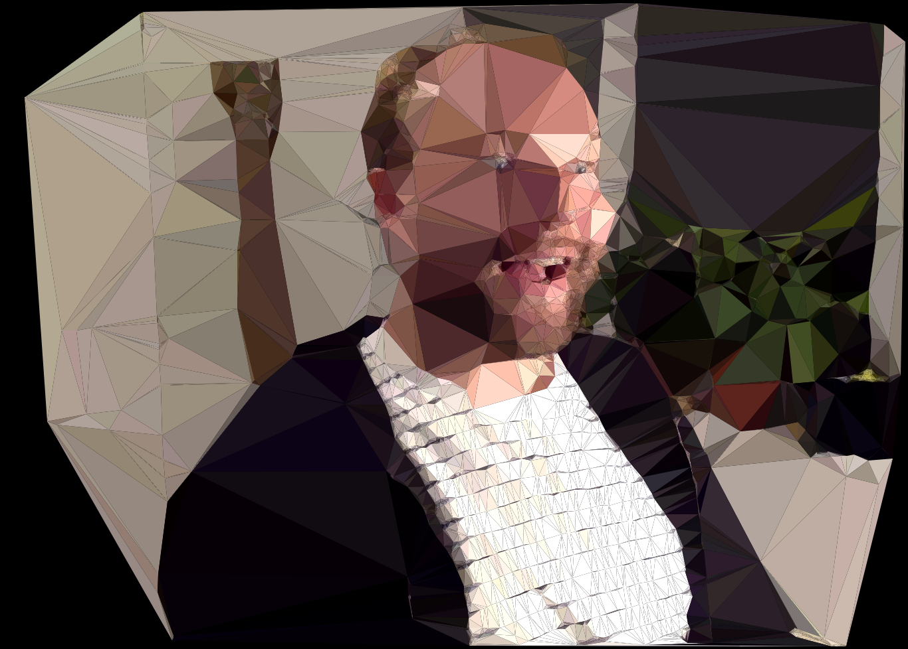

Triangulator
============

A daft thing that visualises what simple machine vision sees when tracking you.

Try it: https://jonty.github.io/triangulator/

It takes your webcam feed, performs [FAST keypoint detection](https://en.wikipedia.org/wiki/Features_from_accelerated_segment_test) on it, then computes the [delaunay triangulation](https://en.wikipedia.org/wiki/Delaunay_triangulation) of those points, samples the colours from the middle of each triangle, then shows your face as many many triangles.

This is your face on triangles:

The code is awful and I have no intention of fixing it.
